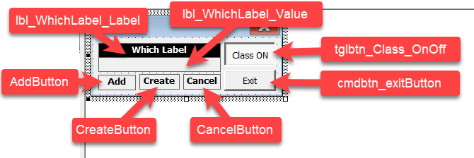

# Excel-VBA-Sample-WithEvents-with-Class
UserDefined Event-handlers for Multiple Controls of Same Type by Using Class(es) employing WithEvents
On April 16th, 2021, someone on Reddit asked a question about how to write efficient code for multiple controls mousedown and mouse up handlers. 
I have decided to help answer that question.
But after I posted my answer, that post was deleted. 

Therefore, in order not to waste my time and energy thinking about a solution for that question, I am hereby sharing that code. 

The .frm and .frx files should be place in the same folder. But only .cls and .frm needs importing from VBIDE-File-Import menu. 

 
The UserForm controls should be renamed as in the image above.

The code in the files contains 2 methods: 
<ul>
  <li>Method1 is simpler method not using the class module.</li>
  <li>Method2 uses a class module to facilitate control event handling from one sub.</li>
</ul>
This behavior can be controlled from the UserForm ToggleButton.  

An extra barebone version is also included but commented inside both .frm and .cls files. 
If the barebone version is required, the non-barebone version <b>must</b> be commented out.  
The barebone version requires the prescence of only 3 Label controls on the UserForm. 
This is just to allow copy/pasting code by opening the .frm and .cls files here in a webbrowser rather than having to download all 3 files and importing into the VBProject file.
The commenting and un-commenting <b>must</b> be done in both UserForm code module and Class module.

 

***
## License
I don't actually like/want/wish to apply CC BY-SA license to what I share, really!\
However, there exists some jerks in this world who thought it's ok to derive my work without proper accreditation.\
I don't care much for fame nor finance but a little credit for the many hours of my limited life I spent on a project is appreciated.\
Shield: [![CC BY-SA 4.0][cc-by-sa-shield]][cc-by-sa]

This work is licensed under a
[Creative Commons Attribution-ShareAlike 4.0 International License][cc-by-sa].

[![CC BY-SA 4.0][cc-by-sa-image]][cc-by-sa]

[cc-by-sa]: http://creativecommons.org/licenses/by-sa/4.0/
[cc-by-sa-image]: https://licensebuttons.net/l/by-sa/4.0/88x31.png
[cc-by-sa-shield]: https://img.shields.io/badge/License-CC%20BY--SA%204.0-lightgrey.svg
***
 
